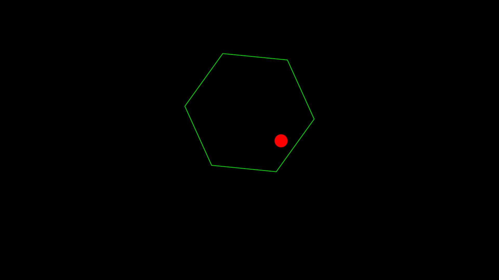
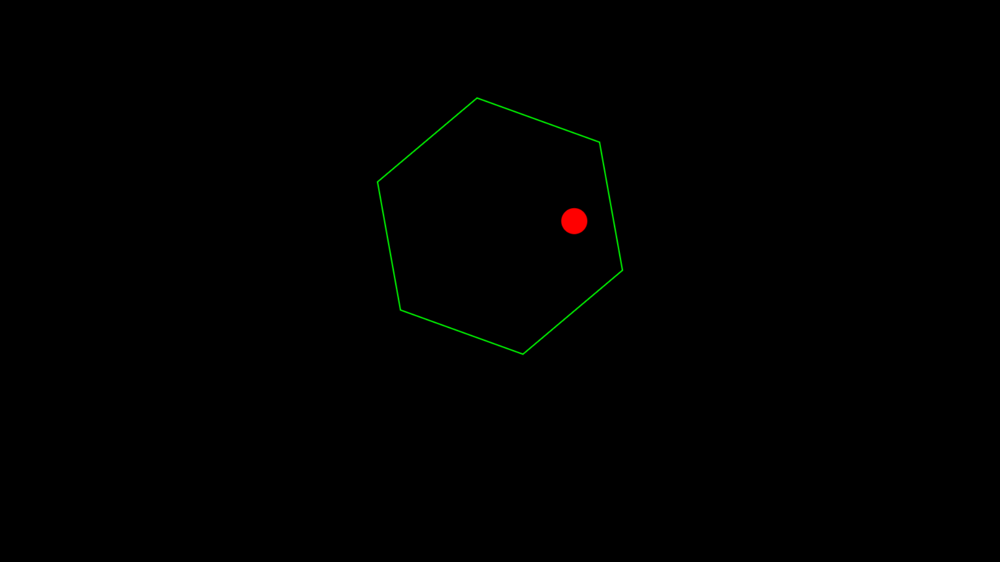
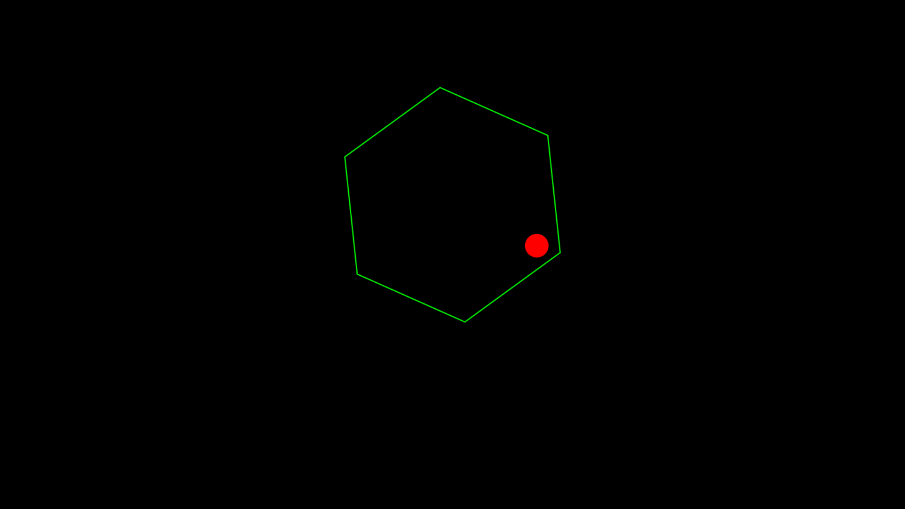
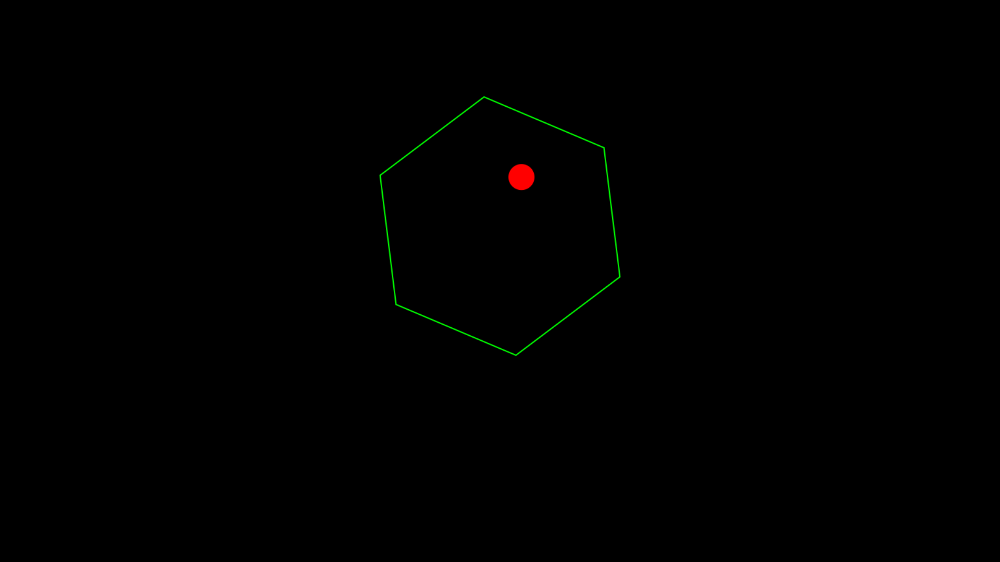
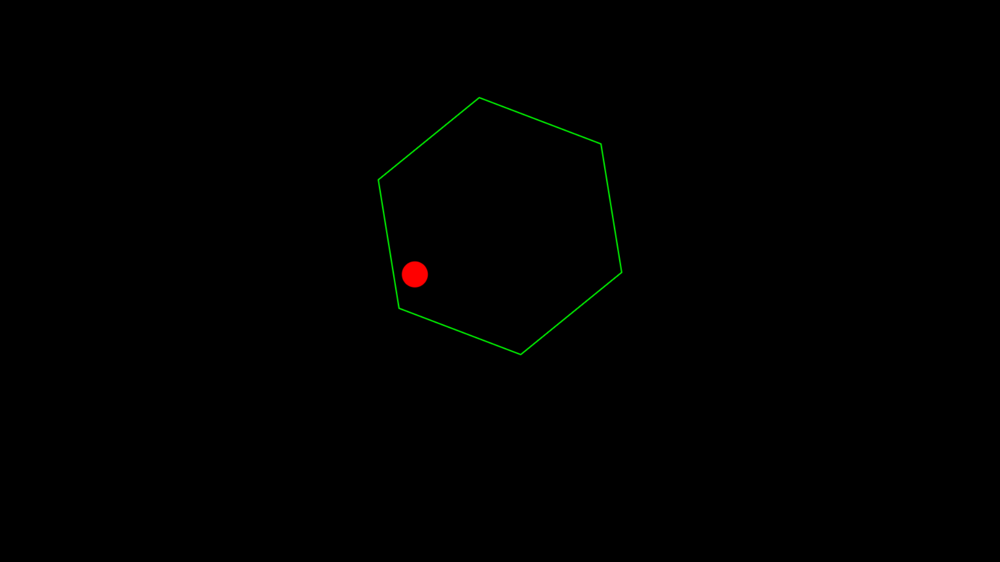

# Bouncing Ball Simulation

A simple bouncing ball physics simulation built using only **HTML, CSS, and JavaScript**.

The project simulates a ball reflecting inside a rotating hexagon using basic vector reflection logic and collision detection.

---

# ✨ Features

- Pure HTML, CSS, and JavaScript
- Rotating hexagon environment
- Reflection-based collision system
- Real-time physics updates
- Adjustable gravity and friction
- Lightweight and dependency-free
- HTML5 Canvas rendering

---

# 🧠 Technical Overview

The simulation is rendered using the HTML5 Canvas API and powered entirely by vanilla JavaScript.

A ball moves freely inside a continuously rotating hexagon and reacts to collisions with each edge using reflection-style bounce calculations.

The implementation includes:

- `requestAnimationFrame` animation loop
- Vector-based collision detection
- Surface normal reflection calculations
- Closest-point line collision checks
- Rotating polygon geometry
- Adjustable gravity and friction values
- Real-time canvas rendering

The bounce behavior is loosely inspired by reflection principles commonly seen in light physics, with slight directional variation creating less repetitive motion patterns.

---

# ⚙️ Physics Behavior

The simulation currently uses:

- Gravity: `0`
- Friction: `0`

This allows the ball to maintain continuous motion without slowing down.

These values can be adjusted to create more realistic movement and energy loss effects.

---

# 🌐 Live Demo

```txt
https://bouncing-ball-n2jtho22u-herry-projects.vercel.app/
```

---

# 📸 Preview











---

# 📁 Project Structure

```bash
Bouncing-Ball-Simulation/
│
├── index.html
├── style.css
├── script.js
├── README.md
│
└── Resources/
    ├── img0.png
    ├── img1.png
    ├── img2.png
    ├── img3.png
    └── img4.png
```

---

# 🚀 Run Locally

## Option 1 — Open Directly

Open `index.html` in your browser.

---

## Option 2 — VS Code Live Server

1. Install the **Live Server** extension
2. Right-click `index.html`
3. Click **Open with Live Server**

---

# 🛠️ Built With

- HTML5
- CSS3
- Vanilla JavaScript
- HTML5 Canvas API

---

# 💡 Notes

The simulation focuses on simple geometric collision behavior rather than full real-world physics accuracy.

The rotating hexagon setup creates continuously changing collision angles, producing dynamic and less predictable movement patterns.

---

# 👨‍💻 Author

### Herry Patel
