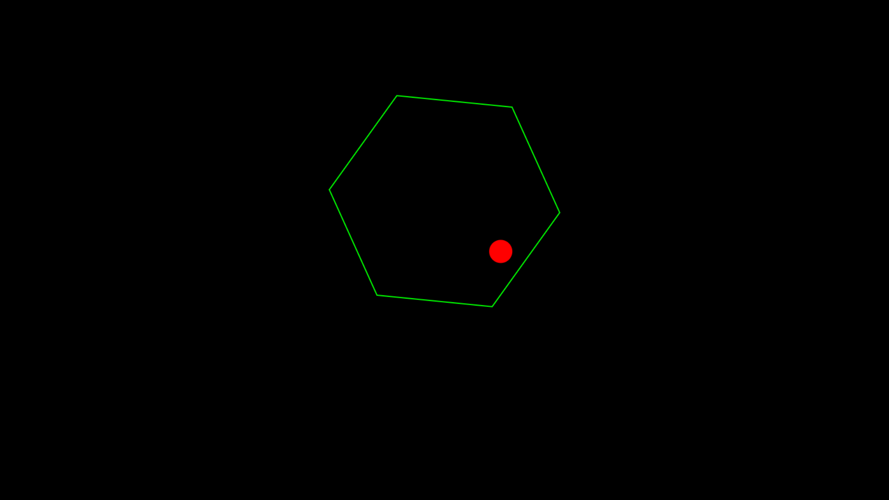
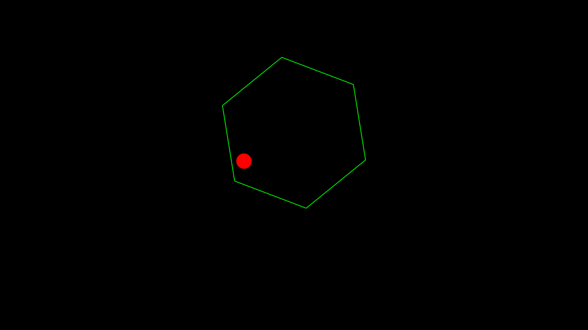

# Bouncing Ball Simulation

A Bouncing Ball Physics Simulation

using only HTML , CSS and JavaScript

Logic based on Reflection Of Light in Nature

With Increased Randomness in The Direction Of Bounce

The Friction and Gravity are set to Zero (can be increased if needed)

